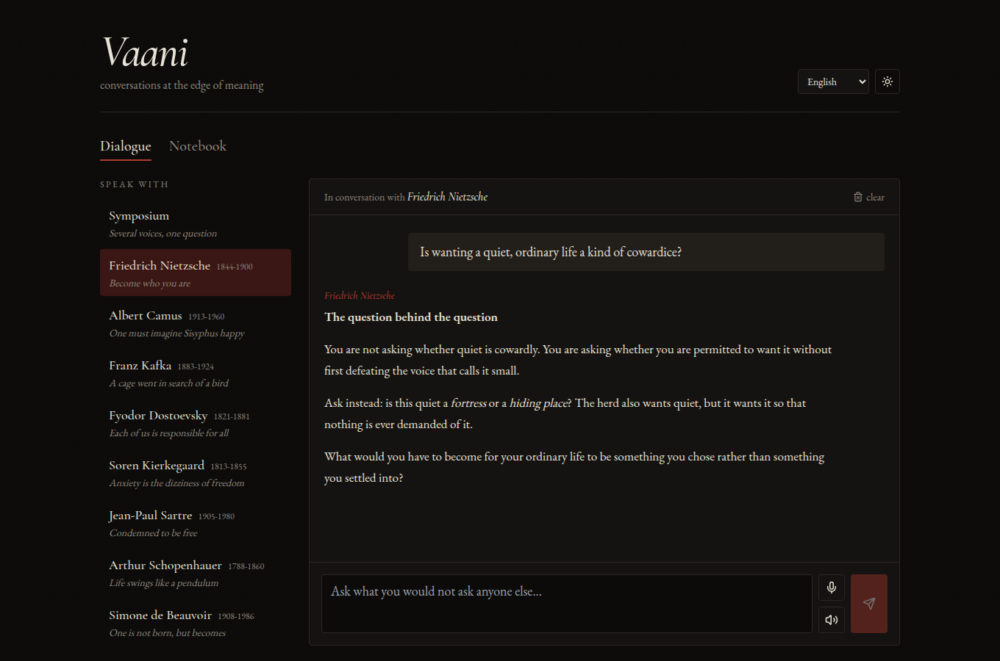
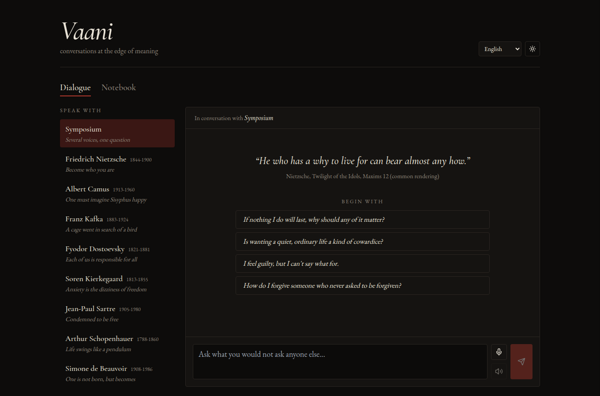
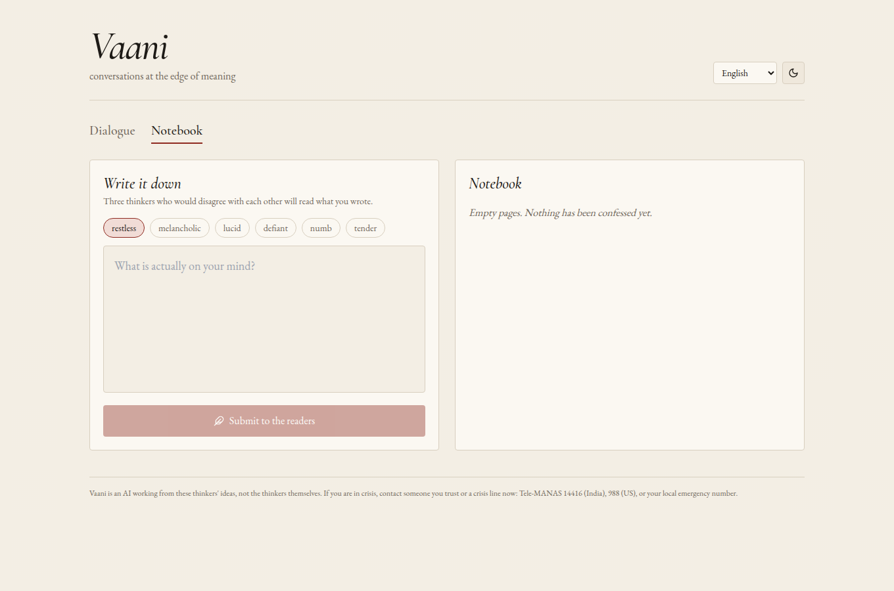

# Vaani

*Conversations at the edge of meaning.*

Vaani is a philosophical interlocutor in the existentialist and absurdist tradition. Bring it the questions you would not ask anyone else and think them through with Nietzsche, Camus, Kafka, Dostoevsky, Kierkegaard, Sartre, Schopenhauer or de Beauvoir. You can also convene a **Symposium**, where several of them answer in turn and argue with each other.



## What it does

- **Dialogue.** Pick a thinker, or the Symposium, and talk. Each voice reasons the way that philosopher did:
  - Nietzsche diagnoses the values hidden in your question.
  - Camus names the absurd and refuses both kinds of suicide.
  - Kafka answers in parables.
  - Kierkegaard speaks to "the single individual".
  - Sartre exposes bad faith.
- **Notebook.** Write a private entry and tag your state of mind. Three thinkers who would disagree with one another each give a short reading of what you wrote.
- **Voice.** Speak your question and have the answer read back, in twelve languages including Hindi, Tamil, Bengali, Marathi, French and German. Replies come in the language you choose.
- **Ink and paper.** A dark reading-room theme and a light paper theme, set in Cormorant and EB Garamond.

| Dialogue | Notebook |
|---|---|
|  |  |

## Principles built into the prompts

- **Unsettle before consoling.** No reflexive reassurance, no self-help listicles.
- **No invented quotations.** Quote only what is genuine and attribute it to the work; otherwise paraphrase and say so.
- **Honest about what it is.** Vaani is an AI working from these thinkers' ideas, not the thinkers themselves.
- **Safety first.** If someone signals self-harm or crisis, Vaani drops the persona and the philosophy and points to real help (Tele-MANAS 14416 in India, 988 in the US). Despair is never romanticised, including Camus's famous opening question.

## Architecture

```
browser (UI, Web Speech) ──► /api/chat     ──► Together AI (Llama 3.3 70B)
                         └─► /api/journal ──┘
        lens + language ids only        system prompts built server-side from src/lib/philosophers.ts
```

- **Prompts stay on the server.** Clients send a thinker id and a language code; the server builds every system prompt itself, so callers cannot inject their own.
- **Route guards** (`src/lib/guard.ts`):
  - only `user`/`assistant` turns are forwarded;
  - history is capped at 20 turns and input at 4,000 characters;
  - 20 requests per minute per IP;
  - output tokens are capped.
- **Local data.** Conversations and notebook entries stay in the browser's localStorage.

## Run

```bash
cp .env.example .env.local      # TOGETHER_API_KEY
npm ci
npm run dev                     # http://localhost:3000
```

Optional: `VAANI_MODEL` selects a different Together chat model.

## Adding a thinker

Add an entry to `LENSES` in `src/lib/philosophers.ts` with an id, name, years, epithet and a `voice` paragraph describing how they think. It appears in the UI and the Symposium roster automatically.

## Stack

Next.js 15, React 19, TypeScript, Tailwind CSS, react-markdown, Together AI.

